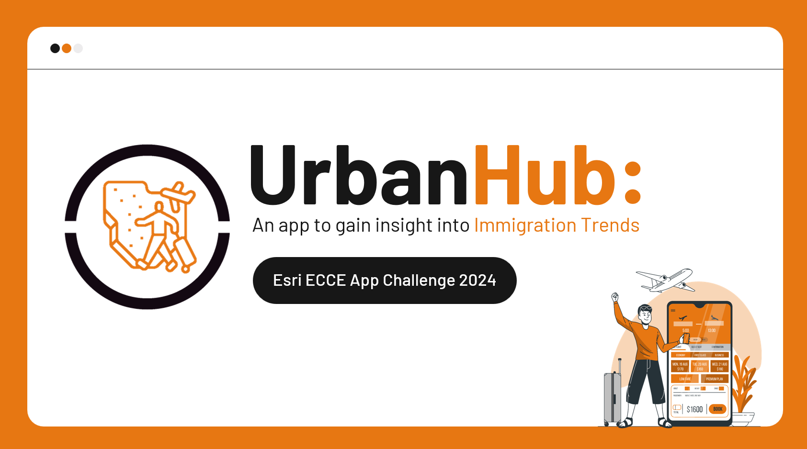
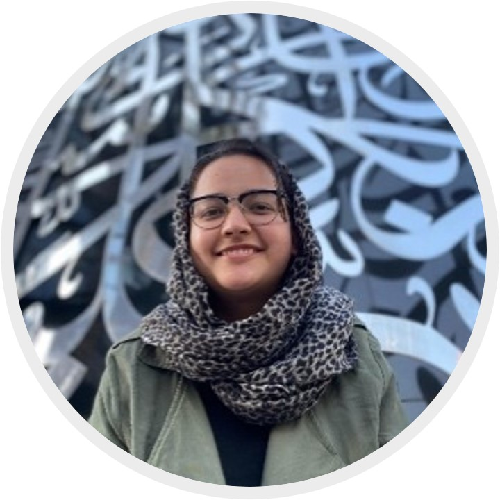

<!-- Introduction -->

<!-- Table of contents (Links) -->
## Table of Contents
1. [Instructions to Run](#instructions)
2. [ Mission Statement ](#mission-statement)
3. [ Data Collection ](#data-collection)
4. [ Features ](#features)
5. [ Team ](#team)
6. [ Sources ](#sources)
7. [ Tools ](#tools)

## 1. Instructions to Run

TODO!

## 2. Mission Statement
Group 4326 created the Urban Hub App to illustrate the complexity of urban expansion in Ontario, Canada, focusing on the distribution of the immigrant population. Our mission is to provide interactive visualizations for policymakers and urban planners to create insightful analyses to understand the challenges in rapid urbanization. 

We believe that understanding the importance of immigration patterns and their potential connection to population density, employment, and housing conditions is essential for creating inclusive and sustainable municipalities and communities. The Urban Hub App will facilitate informed decision-making, promote evidence-based policies, and inspire action towards building resilient urban cities. 

Group 4326 is driven by equity and social justice to create the Urban Hub App, which serves for a positive change in promoting evidence-based decisions, by bridging the gap between data-driven evidence and impactful decisions. We strive to create a future where urban expansion is equal for everyone. 

## 3. Data Collection

TODO!

## 4. Features
- 🧠 **Easy to understand** - No experience in GIS or data analysis needed.
- 🧹 **Clean UI** - Easy-to-use user interface for an effortless and trouble-free experience.
- 🗺️ **Interactive Maps** - Visualize the spatial distribution of key phenomena.
- ✍️ **Written Analysis** - Broken down write-ups for easy comprehension of the results.
- ⏳ **Temporal Analysis** - Visually track immigration waves and observe its relationships to various factors.
- 📚 **Comparative Analysis** - Display multiple layers of data side-by-side and through various web pages.

## 5. Team

**Scarlett Rakowska**

Scarlett Rakowska is a first-year PhD student at the University of Toronto. Her research focuses on conducting geospatial techniques using geographic information systems (GIS) and remote sensing to associate health diseases (e.g. diabetes, asthma) with exposure (e.g., air pollution, traffic congestion) and accessibility (e.g., park space and cycling infrastructure). Scarlett’s research interests include health geography and geospatial statistical analysis. In her free time, Scarlett enjoys running, biking, and painting. 

**Sana Hashim**

Sana Hashim is an undergraduate honours thesis student at the University of Toronto. Her research focuses on monitoring restoration efforts in pits and quarries using drone and field surveys. Sana’s research interests include geographic information systems (GIS) and remote sensing (RS). In her free time, Sana likes to garden, play different sports, and draw. 

- **Leila Uy**

Leila Uy is a master's student at the University of Toronto in Dr. Jue Wang’s research group. Her research focus is on human mobility during natural disasters. Leila enjoys crocheting, painting, reading, and coding in her free time. 

## 6. Sources
|Data| Source |
|--|--|
| Data 1 |  [link]()|

## 7. Tools
- 🌐 [ArcGis Online](https://www.arcgis.com/index.html)
- 💻 [ESRI Experience Builder](https://www.esri.com/en-us/arcgis/products/arcgis-experience-builder/overview)
- 🖼️ [Pexel | Stock images](https://storyset.com/)
